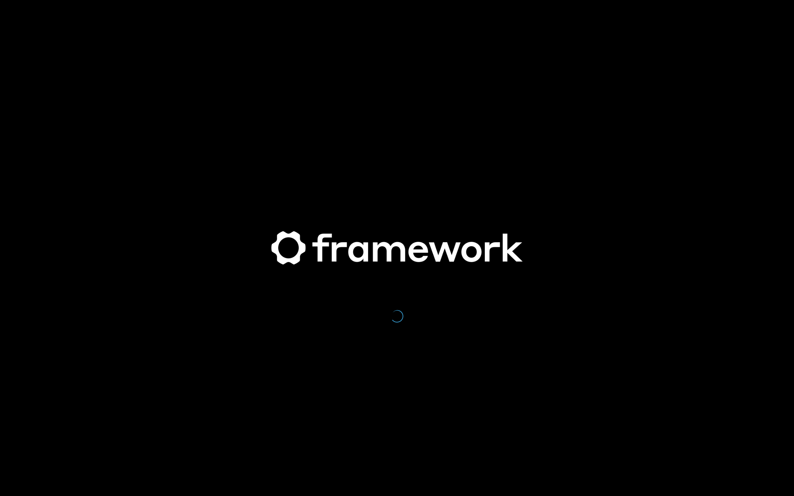

# Framework KDE Splash Theme

Custom KDE Plasma splash screen with the Framework logo instead of KDE's default.
Has the new default loading animation of plasmacomponents3.



## Installation

### Prerequisites

Tested with:
- KDE Plasma 6.3.6
- `gzip` (I think this is required for svgz, usually pre-installed on most Linux distributions)

### Quick Install

```bash
# Clone the repository to the system themes directory
sudo git clone https://github.com/dblanque/framework-kde-splash.git /usr/share/plasma/look-and-feel/com.dblanque.framework

# Set proper permissions
find /usr/share/plasma/look-and-feel/com.dblanque.framework -type d -exec chmod 755 {} +
find /usr/share/plasma/look-and-feel/com.dblanque.framework -type f -exec chmod 644 {} +
```

### Apply the Theme

1. Open **System Settings**
2. Navigate to **Appearance & Style** → **Colors & Themes** → **Splash Screen**
3. Find **"Framework"** in the splash screen list
4. Select it and click **Apply**

## Uninstallation

```bash
# Remove the theme
sudo rm -rf /usr/share/plasma/look-and-feel/com.dblanque.framework

# Revert to default theme (optional)
plasma-apply-lookandfeel -a org.kde.breezelike
```
## License

This theme is licensed under the [GNU General Public License v3.0](LICENSE).

The Framework logo is used under fair use for personal customization purposes.

## Support

If you encounter any issues, please [open an issue](https://github.com/dblanque/framework-kde-splash/issues) on GitHub.

---

**Made with 💙 for Framework Laptops**
